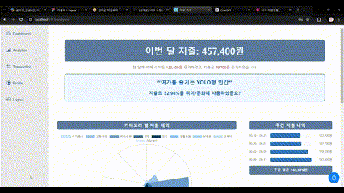
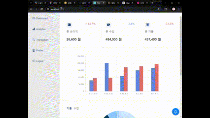
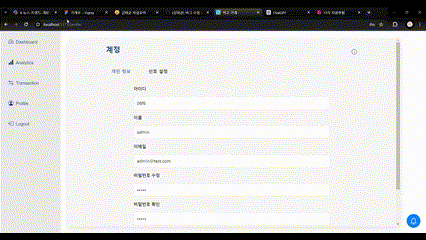

# 💰 적고 가계

### 사용자의 소비를 분석해주는 나만의 가계부


</br>

## 👆🏻 서비스 핵심 기능
### 1. 한눈에 보기 편한 대시보드
> 월별 소비 내용을 카테고리별, 주간별 요약하여 보기 쉽게 제공합니다.
</br>


### 2. 개인화된 지출 분석
> 사용자의 지출을 분석하여 추천하는 카드와 키워드를 알 수 있습니다.



### 3. 손쉬운 가계부 관리
> 지출 내역을 보기 쉽게 캘린더 형식으로 제공하며, 버튼 클릭 한번으로 가계부 관리가 가능합니다.
</br>


### 4. 사용자화 된 알림 및 다국어, 테마 지원
> 사용자에게 사용 내역 알림을 제공하며, 영어 및 다국어 지원과 다크/라이트 테마를 지원합니다.
</br>



</br>
</aside>
<hr>
</br>

## 💽 DB ERD


</br>

## 💻 프로젝트 실행 방법

```
git clone https://github.com/dkssudgo112/KB_GaGyeBu_3.git
cd kb-gagyebu-3
npm install
npm run dev
npm run json-server
```
</br>

## 🌳 git branch 전략

`main branch` : 운영 서버 배포 단위 branch </br>
`dev branch` : 주요 개발 branch, main merge 전 거치는 branch, test 서버로 배포되는 branch </br>
`feature branch` : 각자 개발 branch </br>

</br>

## 🧑‍🔧 Tech Stack
### Frontend
    

### Develop Tool
  

### Communicate Tool
 


</br>

## 👥 팀원 소개
<table>
  <tr>
    <td align="center"></td>
    <td align="center"></td>
    <td align="center"></td>
    <td align="center"></td>
  </tr>
  <tr>
    <td align="center" style="width: 90px;">
      <a href="https://github.com/dkssudgo112">김태균</a>
    </td>
    <td align="center" style="width: 90px;">
      <a href="https://github.com/Hello-LSY">이신영</a>
    </td>
    <td align="center" style="width: 90px;">
      <a href="https://github.com/SangminHann">한상민</a>
    </td>
    <td align="center" style="width: 90px;">
      <a href="https://github.com/yundabin0608">윤다빈</a>
    </td>
  </tr>
</table>